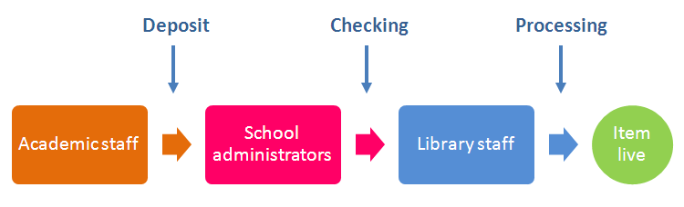

# NECTAR: Roles and Responsibilities

This document explains the responsibilities of academics, school administrators and library staff in the NECTAR deposit workflow.

The basic NECTAR workflow starts with the academic author and progresses through the school administrator and library team before an item is made live:

<small>(The model is slightly different for staff in the School of Health - see below for details.)</small>

## Academic Staff

Academic staff should submit their research outputs to NECTAR where they meet the requirements laid out in the [NECTAR FAQs](http://nectar.northampton.ac.uk/information.html#can_i).

Adding a new item requires a correctly configured NECTAR account. First-time users can email [nectar@northampton.ac.uk](mailto:nectar@northampton.ac.uk) to ensure their account is ready to use.

Items may be added manually using the New Item button or imported from several formats (e.g. DOI import for electronic journal articles).

Guildines for adding items can be found on the [Help with NECTAR](http://nectar.northampton.ac.uk/help) pages and in the help sections of the deposit form itself.

Academics should ensure that the correct formatting is used as per these sources, to minimise delays in processing submissions.

### School of Health

School of Health staff should pass details of their items to the school NECTAR administrator, who is responsible for adding all School of Health outputs. Administrator contact details can be found in the [NECTAR FAQs](http://nectar.northampton.ac.uk/information.html#other_research).

## School Administrators

When an item is deposited by an academic it passes to the relevant school administrator, who will:

- Check that the item meets NECTAR requirements (as per the [FAQ](http://nectar.northampton.ac.uk/information.html#can_i))
- Check that NECTAR formatting guidelines have been followed and amend the item where required
- Check for spelling errors
- Verify that any links are working and go to the correct destination
 
The administrator may return an item if there are numerous or significant problems. The depositing author will receive an email with the item details and the administrator's comments, and the item will return to the author's User Workarea in NECTAR. Returned items can be amended and re-deposited.

## Library Bibliographics Team

When a school administrator verifies that an item has been checked it passes to the bibliographics team within LLS, who will:

- Check the item metadata to professional standards
- Add Library of Congress classification data
- Check the final public appearance of the item 
- Make the item live on NECTAR at the end of this process

The bibliographics team have the option of returning items to either the school administrator or the depositing author where there is sufficient concern.

## NECTAR Team

For submissions that include full-text or supporting document uploads, the NECTAR team within LLS will:

- Review uploaded documents to ensure institutional repository deposit is permitted
- Convert each document to PDF and add a standard coversheet with item and citation details and any content required by the publisher
- Make uploads live and discoverable follwing this process
